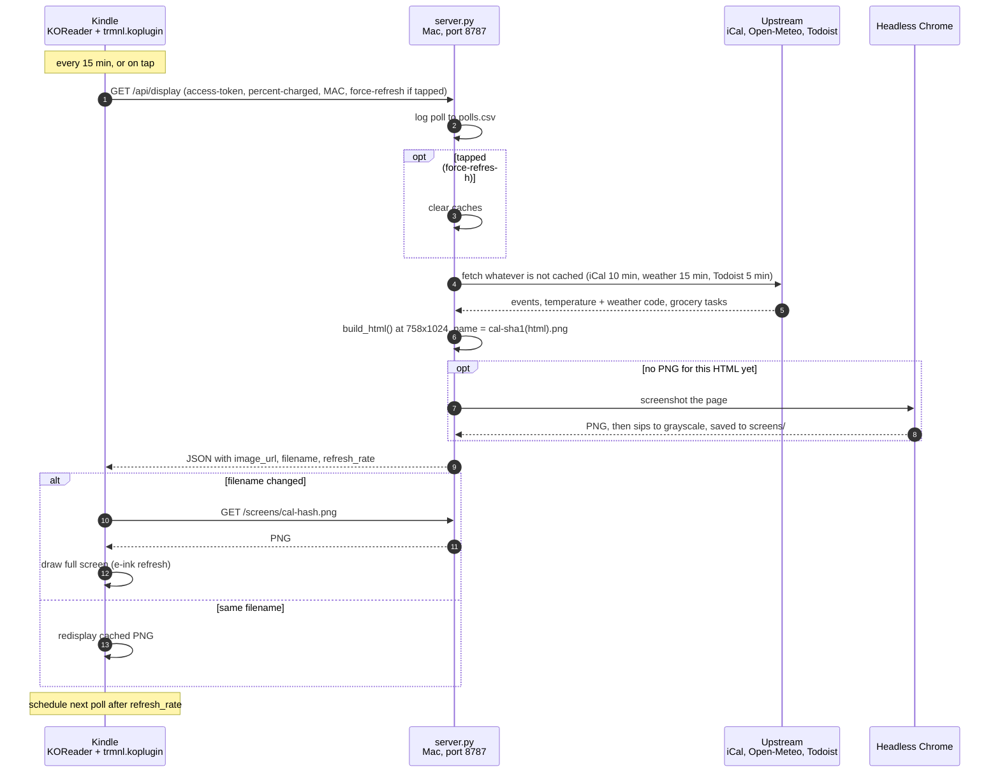

# kindle-micro-server

A family daily calendar on a jailbroken 2012 Kindle Paperwhite (PW1, firmware 5.6.1.1).

The Kindle runs [KOReader](https://github.com/koreader/koreader) with the [TRMNL KOReader plugin](https://github.com/usetrmnl/trmnl-koreader). The plugin is pointed at this server instead of trmnl.com.

## Render pipeline



The PNG's filename is a hash of the page HTML, so the Kindle re-downloads (and the e-ink panel fully redraws) only when something on screen actually changed.

## Server (Mac)

```sh
python3 -m venv .venv && .venv/bin/pip install -r requirements.txt
cp config.example.json config.json   # add your secret iCal URL(s); gitignored
.venv/bin/python server.py           # or: server.py render  (one-off PNG into screens/)
```

- `http://localhost:8787/preview`: the HTML that gets screenshotted
- `polls.csv`: one line per Kindle poll: time, battery %, MAC, forced (tap)
- A tap on the Kindle sends `force-refresh: 1`, which makes the server skip its caches (calendar 10 min, weather 15 min, Todoist 5 min)
- Needs Google Chrome at `/Applications/Google Chrome.app`
- Run at login: copy `com.njh.kindle-calendar.plist` to `~/Library/LaunchAgents/` and `launchctl load -w` it

## Kindle side (`kindle/`)

| File | On the Kindle | Purpose |
|---|---|---|
| `njh.conf` | `/etc/upstart/njh.conf` | Runs `njh-boot.sh` at boot (`start on started framework`) |
| `njh-boot.sh` | `/mnt/us/njh-boot.sh` | Remounts `/mnt/base-us` exec, starts SSH (:2222, key-only), keeps the Kindle awake, turns the frontlight off, launches KOReader |
| `trmnl.koplugin/` | `/mnt/us/koreader/plugins/` | TRMNL plugin, patched: tap = refresh, long-press = close, auto-refresh survives KOReader restarts |

Plugin settings live in `koreader/settings/trmnl.lua` (`base_url = "http://<mac>:8787"`, `auto_refresh_enabled = true`).

Kill switches (create an empty file on the Kindle's USB root): `NO_AUTOSTART` skips the whole boot script; `NO_KOREADER` keeps SSH but skips KOReader.

### Notes on this firmware

- BusyBox 1.17.1 (2015): no `base64`, `telnetd` or `nohup`, and `grep` has no `-E`. The universal `jb.sh` jailbreak installer silently fails to unpack its payload, so KMC, the hotfix, KUAL and `;kpm` never get installed. Hence the hand-rolled boot job.
- `/mnt/us` is a `noexec` fuse mount. Run binaries from `/mnt/base-us` (vfat, remounted exec).
- Root access came from WinterBreak's `com.lab126.transfer` `source_command` trick. The transfer service caches jobs by `unique_id`, so use a fresh id (and a fresh dialog filename) when changing the command.
